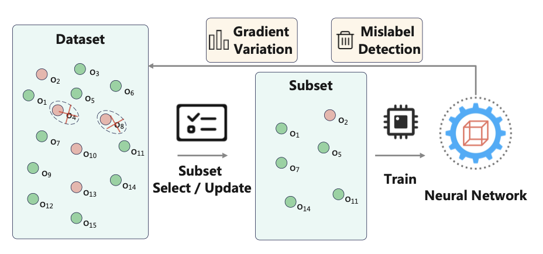
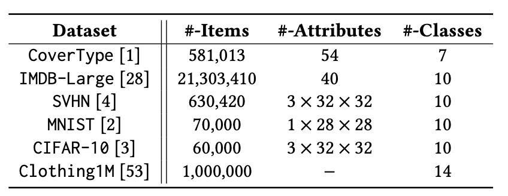
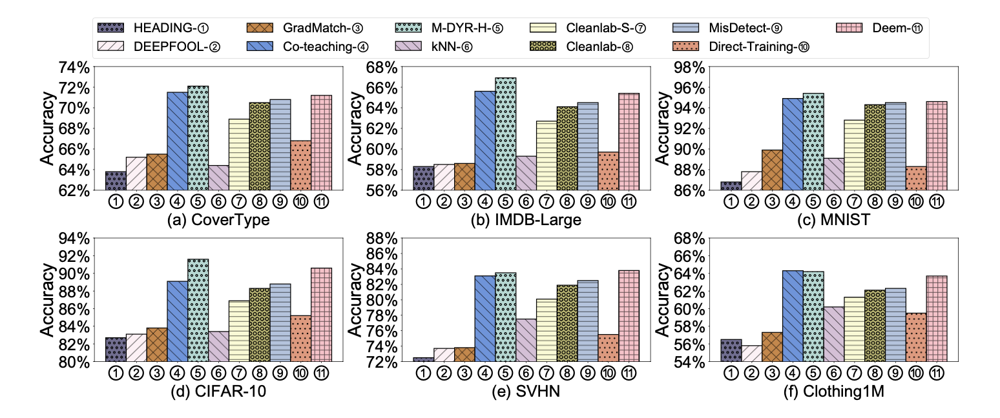
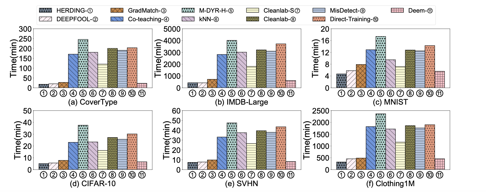

<div align= "center">
    <h1> Two Birds with One Stone: Efficient Deep Learning over Mislabeled Data through Subset Selection</h1>
</div>
<p align="center">
  <a href="#-struct">Folder Structure</a> •
  <a href="#-getstart">GettingStart</a> •
  <a href="#-quickstart">QuickStart</a> •
  <a href="#-result">Result</a> •
</p>


<br>

<div align="center">

</div>
<br>

🌊  This repo contains the codes for our submitted paper. Deem is a novel data-efficient framework that selects a subset of representative training instances under label uncertainty. And it has three steps:

**Mislabel Detection.** Deem identifies potential mislabels by observing the loss of each instance during training.

**Subset Selection.** Deem compute an upper bound of gradient approximation
error (the smaller the error, the better the subset approximates the
full dataset) considering the label uncertainty for deep learning
over mislabeled instances and try to minimize the bound. 

**Adaptive Subset Update.** Two factors trigger the update of the
selected subset: the removal of mislabeled instances and significant
gradient variations caused by iterative training. 

🙌  With Deem, we thoroughly evaluate the state-of-the-art *data cleaning* and *subset selection* approaches on our datasets.

<span id="-struct"></span>
## 📧 Folder Structure


```
.
├─── imgs                    # picture of different experiments
├─── dataset                 # call and process the dataset                       
| ├─── Cifar10.py 
| ├─── Clothing1M.py
| ├─── Covertype.py 
| ├─── imdb.py 
| ├─── Mnist.py 
| └─── Svhn.py  
|
├─── model                   # different models for tabluar and image data                
| ├─── image_model.py 
| └─── table_model.py  
| 
├─── parser                  # parsers of the algorithm              
├─── main.py
├─── README.md
├─── requirements.txt
└─── utils.py                # other utils code of algorithm
```

<br>


<span id="-getstart"></span>

## 🐳 Getting Started

This is an example of how to set up Deem locally. To get a local copy up, running follow these simple example steps.

### Prerequisites

Deem is built on pytorch, with torchvision, torchaudio, and transformers.

To install the required packages, you can create a conda environment:

```sh
conda create --name Deem python=3.8
```

then use pip to install -r requirements.txt

```sh
pip install -r requirements.txt
```

From now on, you can start use Deem by typing 

```sh
python main.py
```

### Datasets

All details of the public datasets we used in our work.

<br>

<div align="center">

</div>
<br>

### Baselines

1. For **HERDING**, the Euclidean distance metric is utilized to measure the feature difference between the initial training dataset $D$ and the selected subset $C$. The pipeline consists of:  
   (i) pre-selecting subset $C$ based on feature distance,  
   (ii) training the model on $S$ until convergence, and  
   (iii) evaluating the model performance.

2. For **GradMatch**, we utilize the same parameters as specified in its original paper. We set the number of selection intervals as 20. The pipeline is to:  
   (i) train the initial model for 20 epochs using the entire training dataset,  
   (ii) perform subset selection,  
   (iii) train for another 20 epochs on the chosen subset,  
   (iv) repeat steps (ii) and (iii) until convergence, and  
   (v) finally evaluate the model performance.

3. For **DEEPFOOL**, we set the number of adversarial perturbations as 50, as described in its original paper. The pipeline is similar to **GradMatch**, and we also set the number of selection intervals as 20, the same as **GradMatch**.

4. For **M-DYR-H**, we set the number of EM iterations as 10, as configured in the original study to fit the Beta Mixture Model. We set the warm-up epoch as 30. The pipeline involves:  
   (i) training the model with the original training dataset $D$ using soft labels, followed by  
   (ii) evaluating the model performance.

5. For **Co-teaching**, we utilize the parameters as outlined in the original paper. In particular, both our method and **Co-teaching** set the mislabel ratio $\epsilon$ to the estimated mislabel ratio for fair comparison. Besides, at the $t-th$ iteration, the selection ratio of small-loss instances is iteratively adjusted according to $1 - \epsilon \cdot \min\left(\frac{t}{10}, 1\right)$.  
    The pipeline includes:  
   (i) concurrently training two models, $f$ and $g$, on the initial training set. During each epoch $t$, **Co-teaching** identifies instances with comparatively low loss in model $f$, computes their loss using model $g$, and updates model parameters of $g$. Subsequently, it selects instances showing relatively low loss in model $g$, determines their loss on model $f$, and adjusts model parameters of $f$ until convergence, and  
   (ii) evaluating the model performance.

6. For **kNN**, we consider an instance to be likely mislabeled if more than half of its neighbors $k$ have labels different from its own. The pipeline involves:  
   (i) employing **kNN** to identify and eliminate mislabeled instances from the initial training dataset,  
   (ii) training the model on the filtered dataset until convergence, and  
   (iii) evaluating the model performance.

7. For **Cleanlab**, the input necessitates a training dataset $D$ alongside a probability matrix. We utilize 10-fold cross-validation to obtain the probability matrix. Then, we call the `find_label_issues` function to identify mislabels based on confidence.  
   The pipeline of this baseline is the same as in **kNN**.

8. For **Cleanlab-S**, we use the same parameters as **Cleanlab**. However, the pipeline is slightly different:  
   (i) using **Cleanlab** to detect and remove mislabeled instances from the original training set,  
   (ii) implementing **GradMatch** to choose a subset from the dataset after removal for model training, and training until convergence, and  
   (iii) evaluating the model performance.

9. For **MisDetect**, we set the percentage of instances removed per iteration as the estimated mislabel ratio divided by 5, the same as the original paper. Besides, the size of the clean pool is set to 10% of the training set. The overall pipeline of **MisDetect** is the same as **kNN**.

10. For **Direct-Training**, we train the model on the training dataset directly until convergence.


<span id="-quickstart"></span>

## 🐠 QuickStrat

Different experiments can be conducted by passing different parameters to `main.py`.
We explain some key parameters here.


> Generating model.We provide different deep learning model for different datasets —— ResNet for image datasets and 3-layer perceptron for tabluar datasets.
>
> > --model [image/table]

For example, if you want to train image datasets, you can use `--model image`.


> Subset Size. You should select subset size for training, if subset size is 1, we use full datasets to train.
>
> > --K [0.0-1.0(float)]

For example, if you want to select different subset size, you can use `--K 0.1`.


> &tau; is a threshold for e'/e which can be added in train data, e.g, 0.3 .
>
> > --tau [&tau;]

For example, if you want to select 0.25 as your $\tau$ you can use `--tau 0.25`.

There are many other parameters and we have provided detailed clarification for them, which can be found in [parser.py](parser/get_parser.py).


<span id="-result"></span>
##  🏆  Results

### Effectiveness of Efficiency of Deem

Effectiveness of Deem and other algorithms:

<div align="center">

</div>
<br>


Efficiency of Deem and other algorithms:

<div align="center">

</div>