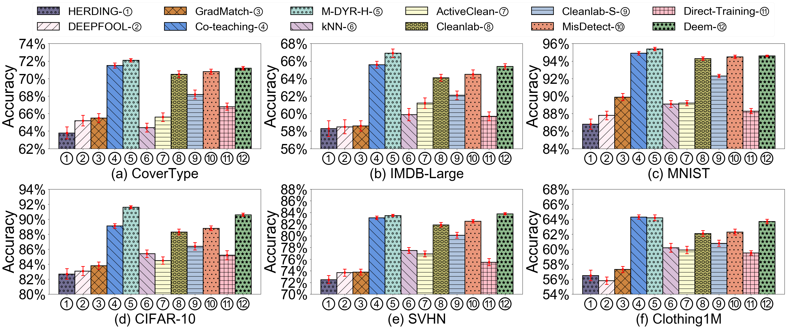
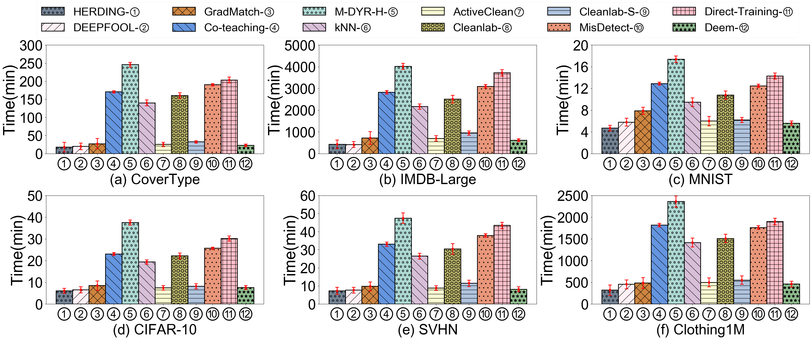

<div align= "center">
    <h1> Two Birds with One Stone: Efficient Deep Learning over Mislabeled Data through Subset Selection</h1>
</div>
<p align="center">
  <a href="#-struct">Folder Structure</a> •
  <a href="#-getstart">GettingStart</a> •
  <a href="#-quickstart">QuickStart</a> •
  <a href="#-result">Result</a> •
</p>


<br>

<div align="center">

</div>
<br>

🌊  This repo contains the codes for our submitted paper. Deem is a novel data-efficient framework that selects a subset of representative training instances under label uncertainty. And it has three steps:

**Mislabel Detection.** Deem identifies potential mislabels by observing the loss of each instance during training.

**Subset Selection.** Deem compute an upper bound of gradient approximation
error (the smaller the error, the better the subset approximates the
full dataset) considering the label uncertainty for deep learning
over mislabeled instances and try to minimize the bound. 

**Adaptive Subset Update.** Two factors trigger the update of the
selected subset: the removal of mislabeled instances and significant
gradient variations caused by iterative training. 

🙌  With Deem, we thoroughly evaluate the state-of-the-art *data cleaning* and *coreset selection* approaches on our datasets.

<span id="-struct"></span>
## 📧 Folder Structure


```
.
├─── imgs                    # picture of different experiments
├─── dataset                 # call and process the dataset                       
| ├─── Cifar10.py 
| ├─── Clothing1M.py
| ├─── Covertype.py 
| ├─── imdb.py 
| ├─── Mnist.py 
| └─── Svhn.py  
|
├─── model                   # different models for tabluar and image data                
| ├─── image_model.py 
| └─── table_model.py  
| 
├─── parser                  # parsers of the algorithm              
├─── main.py
├─── README.md
├─── requirements.txt
└─── utils.py                # other utils code of algorithm
```

<br>


<span id="-getstart"></span>

## 🐳 Getting Started

This is an example of how to set up Deem locally. To get a local copy up, running follow these simple example steps.

### Prerequisites

Deem is built on pytorch, with torchvision, torchaudio, and transformers.

To install the required packages, you can create a conda environment:

```sh
conda create --name Deem python=3.8
```

then use pip to install -r requirements.txt

```sh
pip install -r requirements.txt
```

From now on, you can start use Deem by typing 

```sh
python main.py
```

### Datasets

All details of the public datasets we used in our work.

<br>

<div align="center">

</div>
<br>


<span id="-quickstart"></span>

## 🐠 QuickStrat

Different experiments can be conducted by passing different parameters to `main.py`.
We explain some key parameters here.


> Generating model.We provide different deep learning model for different datasets —— ResNet for image datasets and 3-layer perceptron for tabluar datasets.
>
> > --model [resnet/table]

For example, if you want to train image datasets, you can use `--gen resnet`.


> Coreset Size. You should select coreset size for training, if coreset size is 1, we use full datasets to train.
>
> > --s [0.0-1.0(float)]

For example, if you want to select different coreset size, you can use `--s 0.1`.


> &tau; is a threshold for e'/e which can be added in train data, e.g, 0.3 .
>
> > --tau [tau]

For example, if you want to select 0.25 as your $\tau$ you can use `--tau 0.25`.

There are many other parameters and we have provided detailed clarification for them, which can be found in [parser.py](parser/get_parser.py).


<span id="-result"></span>
##  🏆  Results

### Effectiveness of Efficiency of Deem

Effectiveness of Deem and other algorithms:

<div align="center">

</div>
<br>


Efficiency of Deem and other algorithms:

<div align="center">

</div>